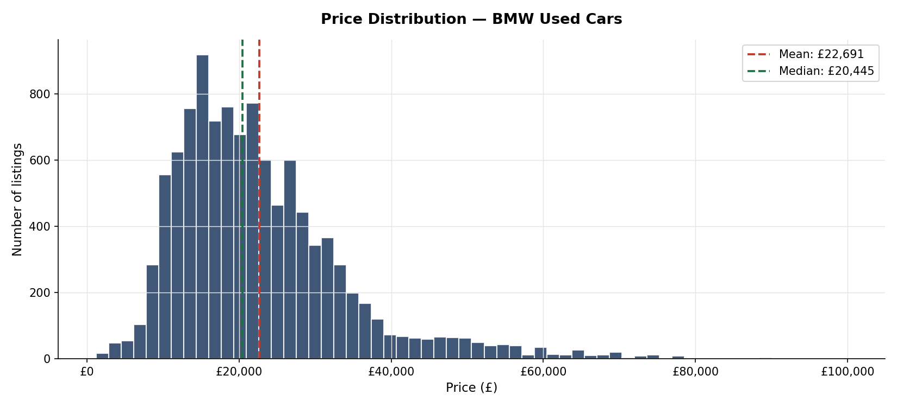
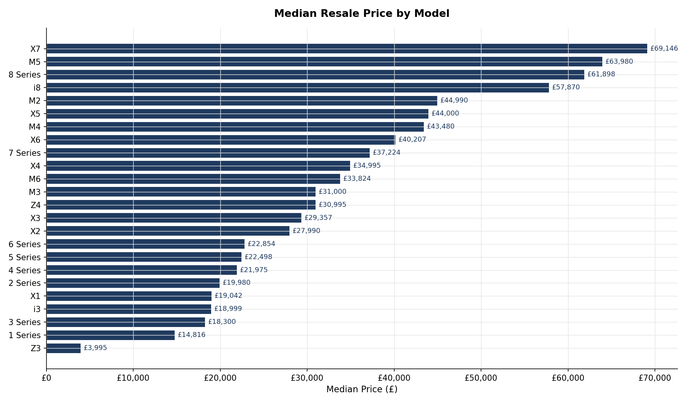
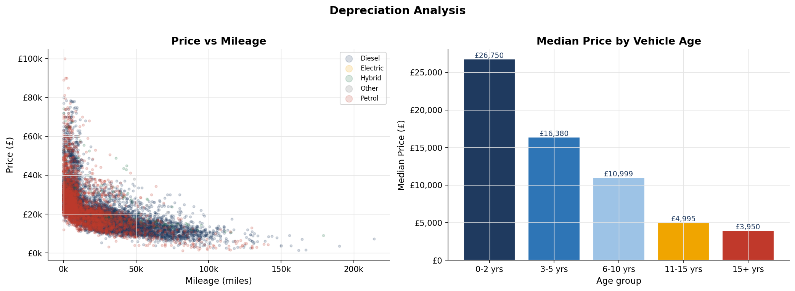
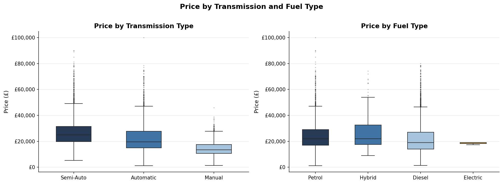
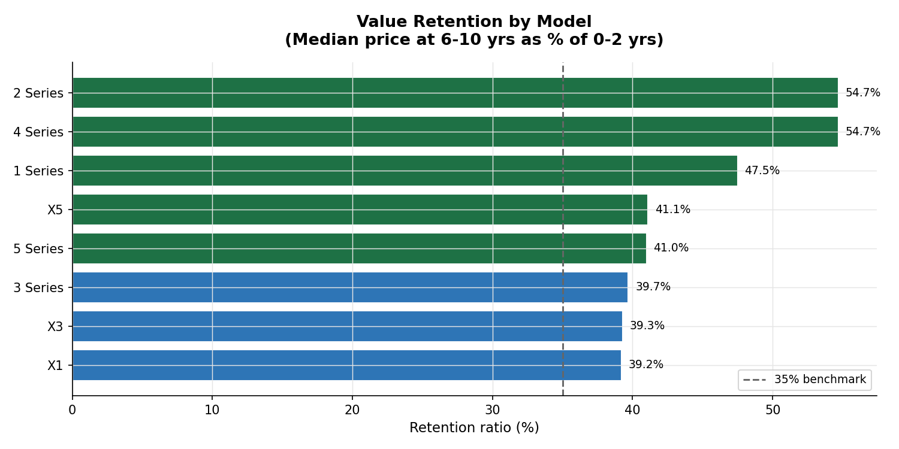
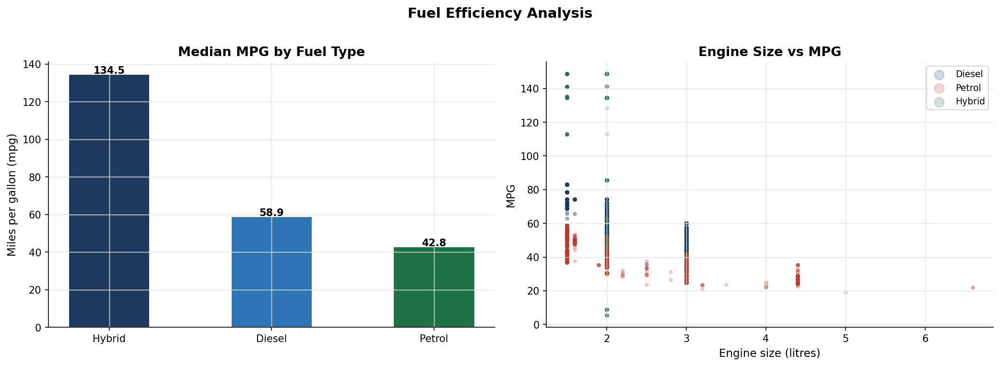
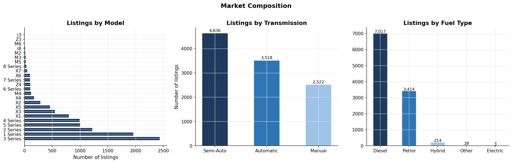

# BMW Used Cars — Exploratory Data Analysis

Exploratory data analysis on a dataset of used BMW vehicles listed for sale in the UK market. The goal is to understand the factors that drive resale price and extract insights about depreciation, model performance and market composition.

Dataset sourced from Kaggle: [BMW Used Car Listing](https://www.kaggle.com/datasets/mysarahmadbhat/bmw-used-car-listing)

---

## Objectives

1. Understand the structure and quality of the dataset
2. Clean and prepare the data — handle inconsistencies and engineer useful variables
3. Analyze price distribution across models, fuel types and transmission types
4. Examine how mileage and vehicle age affect resale value
5. Identify which models retain value best over time
6. Explore fuel efficiency across fuel types and engine sizes
7. Summarize key findings with actionable insights

---

## Project structure

```
bmw-used-cars-eda/
├── data/
│   └── bmw_used_cars.csv          # Original dataset (10,781 records)
├── notebooks/
│   └── bmw_eda.ipynb              # Full analysis notebook
├── img/
│   ├── 01_price_distribution.png
│   ├── 02_price_by_model.png
│   ├── 03_depreciation.png
│   ├── 04_price_transmission_fuel.png
│   ├── 05_value_retention.png
│   ├── 06_efficiency.png
│   └── 07_market_composition.png
└── README.md
```

---

## Dataset

| Column | Description |
|---|---|
| `model` | BMW model name (1 Series, X5, M3, etc.) |
| `year` | Year of registration |
| `price` | Listing price in GBP (£) |
| `transmission` | Automatic, Manual or Semi-Auto |
| `mileage` | Total mileage in miles |
| `fuelType` | Diesel, Petrol, Hybrid, Electric or Other |
| `tax` | Annual road tax in GBP |
| `mpg` | Fuel efficiency in miles per gallon |
| `engineSize` | Engine displacement in litres |

---

## Key findings

**Price**
- M-series and large-body models (7 Series, 8 Series) command the highest resale prices, with medians well above £40,000
- The 1 Series and i3 sit at the lower end of the range, reflecting their entry-level positioning
- Automatic and semi-automatic vehicles carry a consistent price premium over manual equivalents

**Depreciation**
- Vehicle age and mileage are the strongest predictors of resale value
- Depreciation is steepest in the first 5 years — vehicles lose roughly 50–60% of their 0–2 year value by the time they reach 6–10 years old
- SUV models (X3, X5) retain value better than saloon equivalents of similar age

**Market composition**
- Diesel dominates the dataset, accounting for the majority of listings — consistent with UK driving patterns
- The 3 Series is by far the most listed model, reflecting its popularity in both new and used markets
- Hybrid and electric listings are small in volume but growing

**Efficiency**
- Diesel vehicles achieve consistently higher mpg figures than petrol equivalents
- Larger engine sizes correlate with lower efficiency across all fuel types

---

## Visualizations

### Price distribution


### Median price by model


### Depreciation — mileage and age


### Price by transmission and fuel type


### Value retention by model


### Fuel efficiency


### Market composition


---

## How to run

```bash
git clone https://github.com/alanomelchenco/bmw-used-cars-eda.git
cd bmw-used-cars-eda

pip install pandas numpy matplotlib seaborn

jupyter notebook notebooks/bmw_eda.ipynb
```

---

## Tools

- Python 3.12
- pandas
- matplotlib / seaborn
- numpy
- Jupyter Notebook

---

**Alan Omelchenco** — [LinkedIn](https://linkedin.com/in/alanomelchenco) · alannomelchenco@gmail.com
